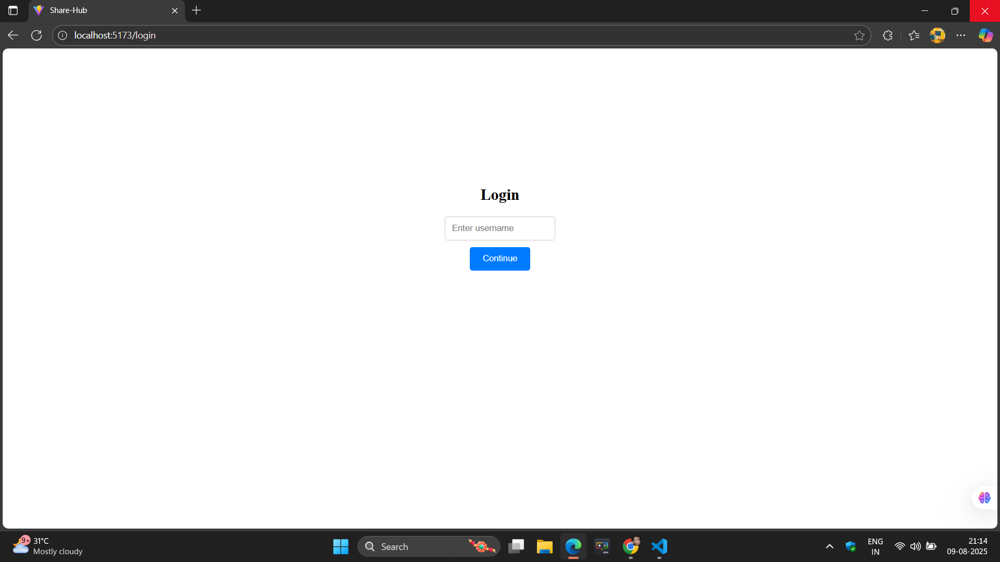
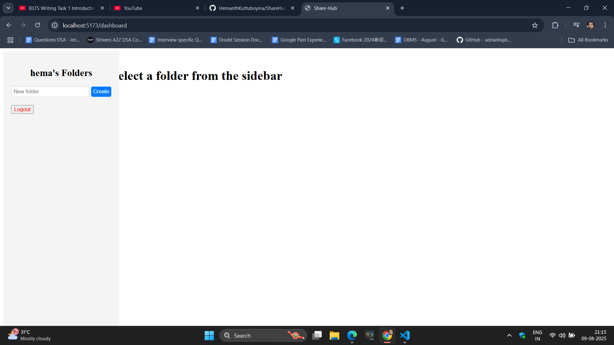
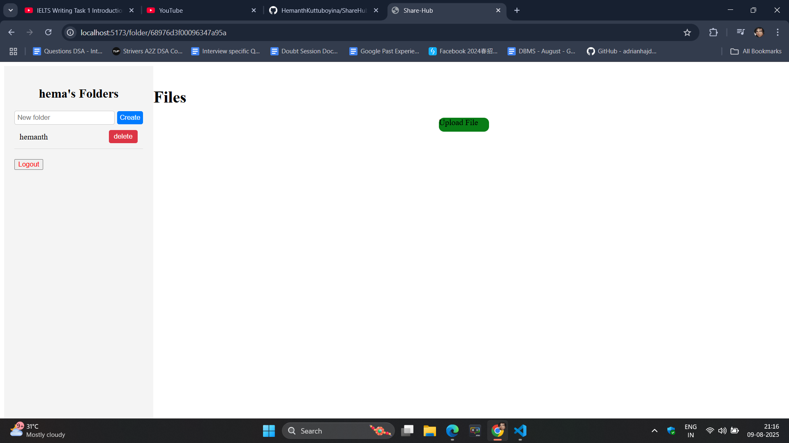
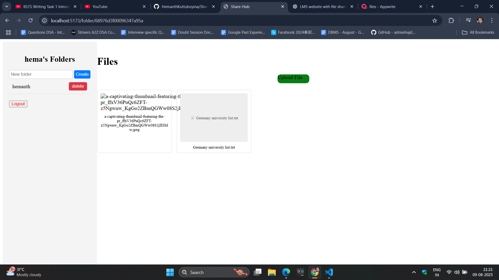

Here’s your **complete single README.md** in one block so you can copy it easily:
# HShareHub - Classroom File Sharing Platform

**Tagline:** Connecting Classrooms Across the Globe

HShareHub is a Google Classroom–like platform built with **ReactJS** and **Appwrite** that allows teachers and students to share files, collaborate, and manage classroom resources. It supports username-only login, role-based access, and file previews for a variety of file types.

---

## 🚀 Features

- **Username-only Login** – No email/password required, just a username.
- **Role-based Access Control** – Teachers can upload/manage files, students can view/download.
- **File Preview Support** – Preview images, PDFs, and text files before downloading.
- **Folder Management** – Create, delete, and organize folders.
- **Responsive UI** – 10% sidebar for folders, rest for file previews.

---

## 🖼 Screenshots

### Login Page


### Dashboard


### Folders View


### Files View


---

## 🛠 Tech Stack

- **Frontend:** ReactJS (Vite), CSS (Flexbox/Grid)
- **Backend:** Appwrite (Database, Storage, Authentication)
- **Hosting:** Appwrite Cloud (fra.cloud.appwrite.io)

---

## 📦 Project Setup

1️⃣ **Clone the Repository**
```bash
git clone https://github.com/yourusername/hsharehub.git
cd hsharehub
````

2️⃣ **Install Dependencies**

```bash
npm install
```

3️⃣ **Configure Environment Variables**
Create a `.env` file in the root:

```env
VITE_APPWRITE_ENDPOINT=https://fra.cloud.appwrite.io/v1
VITE_APPWRITE_PROJECT_ID=YOUR_PROJECT_ID
VITE_APPWRITE_DATABASE_ID=YOUR_DATABASE_ID
VITE_APPWRITE_FOLDER_COLLECTION_ID=YOUR_FOLDER_COLLECTION_ID
VITE_APPWRITE_FILE_COLLECTION_ID=YOUR_FILE_COLLECTION_ID
VITE_APPWRITE_BUCKET_ID=YOUR_BUCKET_ID
```

4️⃣ **Run the Development Server**

```bash
npm run dev
```

---

## 📂 Appwrite Database Structure

### **Folders Collection**

| Field | Type   | Example    |
| ----- | ------ | ---------- |
| name  | String | Math Class |
| owner | String | teacher123 |

### **Files Collection**

| Field    | Type   | Example            |
| -------- | ------ | ------------------ |
| name     | String | lesson1.pdf        |
| folderId | String | folder\_doc\_id    |
| fileId   | String | appwrite\_file\_id |
| fileType | String | application/pdf    |

### **User**

| Field    | Type  |
| ---------|------ |
| username | String|

### **Create a Bucket**
---

## 🖼 File Preview Support

* **Images:** PNG, JPG, JPEG
* **PDF:** Embedded PDF viewer
* **Text:** `.txt` preview

---

## 📜 License
